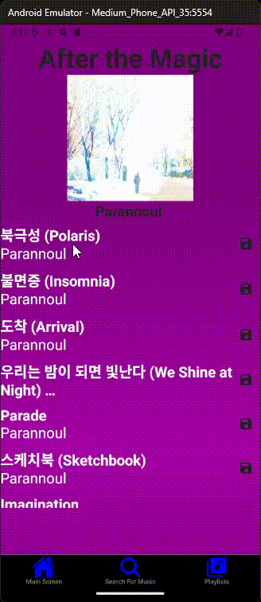
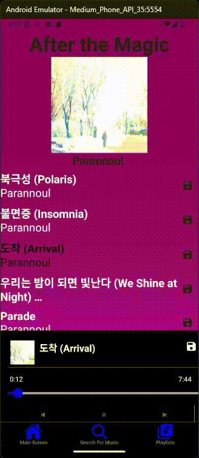
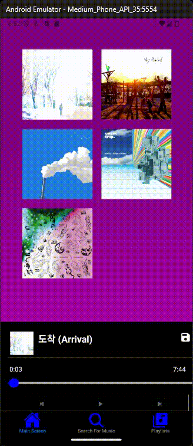
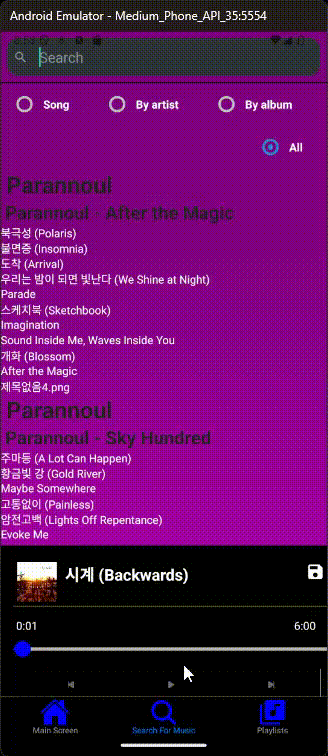
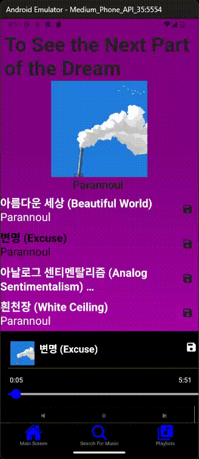
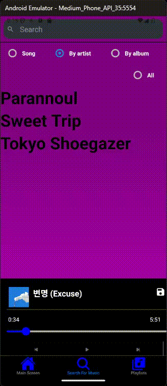

A music storage system where you can store and play music. Original name was spotty, but changed to Jammi. 

Images folder contains images that should give an idea of the app. 

Originally in javascript, started re-writing into typescript in 7/18/2024 and

Finished re-writing in 7/26/2024

Features:
-Playing music (WOW)
- Music player that is present around the app allows user to skip, go to previous, pause, play, and seek through currently playing songs.  Can hide or show music player.

- Generate albums to play in app simply by placing an album folder with songs into assets and running node GenerateAlbums.js

  
- Search through songs

- Make playlists

  
- Go to an artists page to see all their songs and albums

Uses:
- React Redux and useContext, although redux is more heavily used
- React native elements for UI
- Various expo libraries for audio and sending files to device
- AsyncStorage
- React navigation
- Amazon AWS for backend (not completed or optimized but is ready to link)

